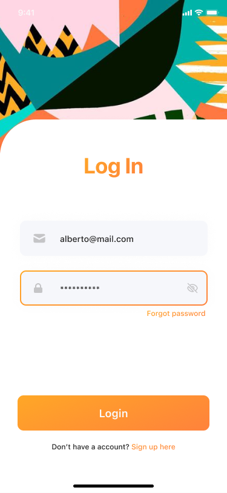

# CHAT App

# Overview
The CHAT App is a real-time messaging application built using Expo for the front end, Firebase for authentication, and Firestore for real-time data storage. The app follows the design specifications provided in the Figma design files.

# Features
1. **Real-Time Messaging**: Engage in real-time conversations with other users.
2. **User Authentication**: Secure user authentication using Firebase Authentication.
3. **Message Persistence**: Messages are stored in Firestore, ensuring data persistence.

# Technologies Used
1. **Expo**: A framework for building cross-platform applications using React Native.
2. **Firebase (Authentication)**: For user authentication.
3. **Firebase (Firestore)**: A NoSQL cloud database for storing and syncing data in real time.
4. **Figma**: Design files for creating a visually appealing and consistent user interface.

# Prerequisites
Before you begin, ensure you have the following installed:

1. **Node.js**: Download and install Node.js.
2. **Expo CLI**: Install Expo CLI globally using the command `npm install -g expo-cli`.
3. **Firebase Account**: Set up a Firebase project and obtain the configuration details.

# Installation
Clone the repository:
`git clone https://github.com/arunkjojo/ChatApp-AJOin.git`  
`cd chat-app`

# Install dependencies:
`npm install`

Create a Firebase project and configure the Firebase credentials in the app.

# Start the Expo development server:
`expo start`
Open the Expo app on your mobile device and scan the QR code to run the app.

# Configuration
Update the Firebase configuration in the **config/firebase.js** file with your own Firebase project details.
// config/firebase.js

import { initializeApp } from "firebase/app"; 
import { getAuth } from "firebase/auth"; 
import { getFirestore } from "firebase/firestore"; 

const firebaseConfig = { 
  apiKey: 'YOUR_API_KEY', 
  authDomain: 'YOUR_AUTH_DOMAIN', 
  projectId: 'YOUR_PROJECT_ID', 
  storageBucket: 'YOUR_STORAGE_BUCKET', 
  messagingSenderId: 'YOUR_MESSAGING_SENDER_ID', 
  appId: 'YOUR_APP_ID', 
}; 
initializeApp(firebaseConfig); 
export const auth = getAuth(); 
export const database = getFirestore(); 

# Design
The app's design is based on the Figma design files provided. For any design-related issues or modifications, refer to the Figma files. 
**design/Chat app Expo-RN.fig** 
[Figma Chat App Prototype](https://www.figma.com/proto/h2UCUpAjj0mIv6lMoxURi2/Chat-app-Expo-RN?type=design&node-id=2-52&t=M6egSU33JoCc6I5l-1&scaling=min-zoom&page-id=0%3A1&starting-point-node-id=2%3A52&mode=design)

# Contributing
Contributions are welcome! Feel free to open issues or submit pull requests.

# License
This project is licensed under the MIT License.
